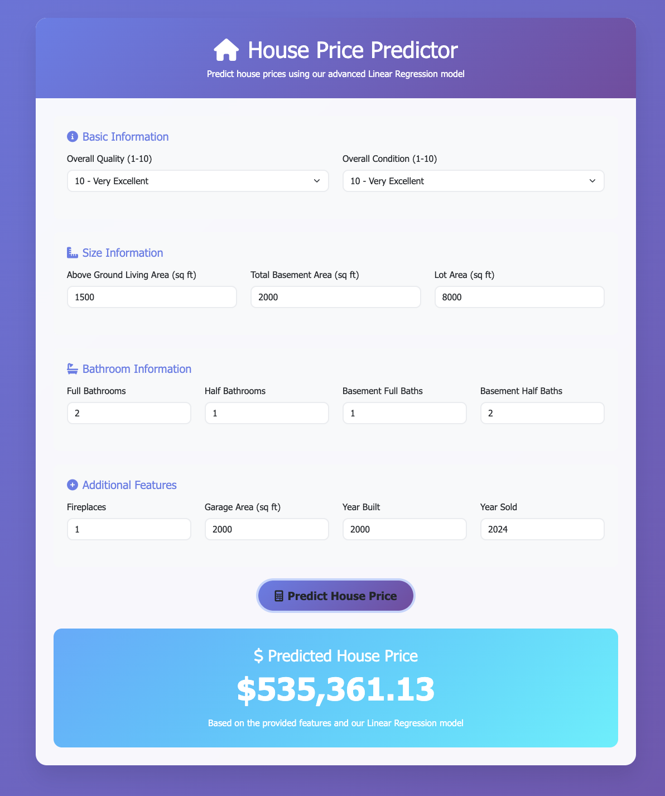

# 🏠 House Price Predictor

A machine learning web application that predicts house prices using Linear Regression. Built with Flask and modern web technologies.

## 📸 Preview



*The application interface showing real-time house price prediction with a clean, modern design*

## 📊 Model Performance

- **R² Score:** 97.91%
- **RMSE:** $10,641.36
- **MAE:** $8,470.30

## 🛠️ Tech Stack

- **Backend:** Python, Flask
- **Machine Learning:** Scikit-learn, Linear Regression
- **Data Processing:** Pandas, NumPy
- **Frontend:** HTML, CSS, JavaScript, Bootstrap 5

## 🏃‍♂️ Quick Start

### Local Development

1. **Clone the repository**
   ```bash
   git clone <your-repo-url>
   cd house-price-predictions
   ```

2. **Install dependencies**
   ```bash
   pip install -r requirements.txt
   ```

3. **Run the application**
   ```bash
   python app.py
   ```

4. **Open your browser**
   Navigate to `http://localhost:8080`

## 📁 Project Structure

```
house-price-predictions/
├── app.py                 # Flask application
├── house_price_prediction.py  # ML model and preprocessing
├── requirements.txt       # Python dependencies
├── train.csv            # Training dataset
├── test.csv             # Test dataset
├── templates/
│   ├── index.html       # Main prediction form
│   └── about.html       # About page
└── README.md           # This file
```

## 🎯 Features

- **Real-time Predictions:** Get instant house price predictions
- **User-friendly Interface:** Clean, responsive web design
- **Comprehensive Input:** 20+ house features for accurate predictions
- **Mobile Responsive:** Works on all devices
- **Local Development:** Easy to run and test locally

## 📈 Key Features Used

The model considers these important house features:
- **Size:** Total square footage, basement area, garage area
- **Quality:** Overall quality, condition, exterior quality
- **Age:** Year built, year remodeled, garage year built
- **Amenities:** Bathrooms, bedrooms, fireplaces, pool
- **Location:** Neighborhood, street access, utilities

## 🔧 API Usage

### Predict House Price

**Endpoint:** `POST /predict`

**Request Body:**
```json
{
  "LotArea": 8450,
  "OverallQual": 7,
  "YearBuilt": 2003,
  "TotalBsmtSF": 856,
  "1stFlrSF": 856,
  "GrLivArea": 1710,
  "FullBath": 2,
  "TotRmsAbvGrd": 8,
  "GarageCars": 2,
  "GarageArea": 548
}
```

**Response:**
```json
{
  "success": true,
  "prediction": "$245,678.90",
  "raw_prediction": 245678.90
}
```

## 🚀 Performance Optimization

- **Model Caching:** Trained model loaded once on startup
- **Efficient Preprocessing:** Optimized data pipeline
- **Error Handling:** Robust error handling for edge cases
- **Debug Mode:** Enabled for local development

## 📝 License

This project is open source and available under the [MIT License](LICENSE).

## 🤝 Contributing

1. Fork the repository
2. Create a feature branch
3. Make your changes
4. Test thoroughly
5. Submit a pull request

## 📞 Support

If you encounter any issues or have questions:
- Open an issue on GitHub
- Check the console output for error messages
- Review the error handling in the application

---

**Built with ❤️ using Python, Flask, and Machine Learning**
